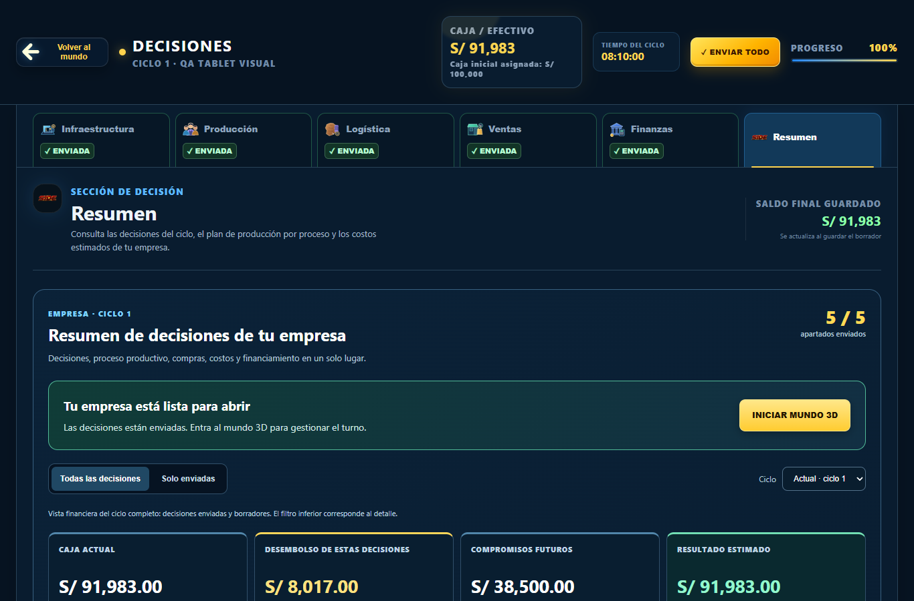
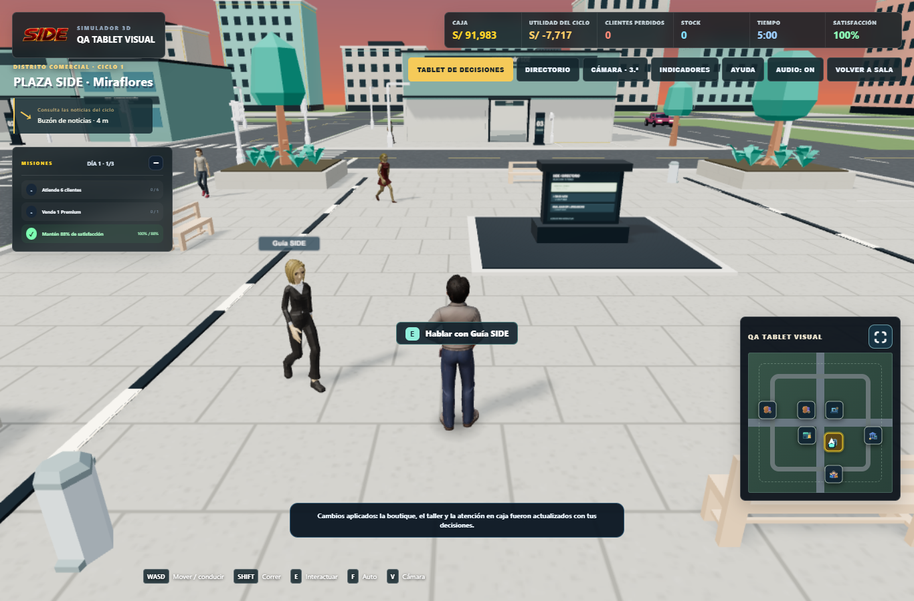

# Corrección NPC, colisiones, Tablet y HUD — 2026-09-30

## Alcance y línea base

Proyecto: SIDE1, JavaScript vanilla, Three.js local 0.180.0. No se modifican el catálogo de avatares, las reglas de decisiones/ciclos ni Supabase. Se preservan los cambios locales preexistentes de recursos, herramientas y evidencias.

Se leyó `AGENTS.md` antes de editar. En la fase inicial no existían `.claude/skills/` ni la skill `frontend-design`. La búsqueda ampliada en el caché `.codex/.tmp/plugins/plugins/` encontró y se leyeron `game-ui-frontend`, `three-webgl-game`, `web-3d-asset-pipeline`, `game-playtest`, `systematic-debugging`, `frontend-testing-debugging` y `verification-before-completion`. Se aplicaron separación entre simulación/render, unidades y pivotes consistentes, HUD DOM con centro libre, diagnóstico previo y verificación real antes de afirmar resultados. La revisión independiente leyó también `review-agent`. Se conservaron el stack y la solución círculo/cápsula solicitados por el usuario, sin migrar a otras bibliotecas. Las verificaciones usan los runners Playwright del proyecto y Chromium headless; el skill Browser no está disponible en esta sesión. No se automatizaron aplicaciones Windows.

Diagnóstico: subagente `diagnostico`, solo lectura, sin commit. Correcciones: subagentes A–E con archivos separados; integración del simulador por el agente principal después de A. Revisión independiente posterior.

Continuación 2026-10-01: se listaron las 22 skills de `.agents/skills/`; ahora están disponibles `webapp-testing` y `frontend-design` y se leyeron ambas. Se aplica `webapp-testing` al cierre de pruebas, screenshots y benchmarks (principal, revisor y subagente FPS); se mantienen los runners JavaScript Playwright existentes para no rehacer las verificaciones. `frontend-design` sirve para revisar coherencia visual; no requiere cambios adicionales al HUD ya corregido. La sesión anterior utilizó `game-ui-frontend` en E porque la skill aún no estaba instalada. Subagente de piso: `colisiones`, subagente de FPS/capturas: `hud`, verificador y revisión independiente: `revisor`. La GPU de software se reserva a un único subagente en cada momento.

| Agente en la continuación | Skills aplicadas |
| --- | --- |
| Principal | `webapp-testing`, `frontend-design` para lectura/revisión visual; skills de 3D/depuración/verificación del caché leídas en la fase inicial. |
| `colisiones`, piso mundial | `three-webgl-game`, `systematic-debugging`, `verification-before-completion`; `webapp-testing` leído, sin lanzar navegador durante el benchmark. |
| `hud`, FPS/capturas | `webapp-testing` para Playwright, aislamiento y evidencias; `frontend-design` para revisión del HUD existente, sin rediseñarlo. |
| `revisor`, verificación independiente | `webapp-testing`, `frontend-design` para capturas y evaluación visual; `review-agent` para revisión del diff. El helper `with_server.py --help` se comprobó; se conserva el servidor efímero de los runners existentes. |

Línea base: **263/263 pruebas Node**. `playable_hub.cjs` pasa. `world_startup.cjs` pasa el escenario `all`, pero el escenario `sections` agota el timeout de 30 s esperando frames mientras se ejecuta en paralelo con el benchmark SwiftShader; se verificará de nuevo sin competición gráfica. FPS iniciales SwiftShader: Baja 3, Media 1, Alta 1 (medianas de cuatro muestras, con otros runners simultáneos; no equivalen a rendimiento de GPU física).

Evidencias anteriores: `tests/output/npc-tablet-hud-2026-09-30/store-before.png` y `plaza-before.png`. Logs originales en `.codex-work/npc-fix-baseline/`.

## Causas identificadas antes de editar

1. **Escala:** `js/simulator3d.js:1302` normaliza bounding box únicamente en la rama `excludedCityIds`; plaza y tienda heredan las unidades del GLB. Otras factorías y el jugador no comparten altura objetivo.
2. **Movimiento:** `js/simulator3d.js:3116` crea la guía con `pause:Infinity` y un solo punto. `3385` detiene peatones cerca del jugador/coche sin recuperación; no hay watchdog ni validación del spawn.
3. **Suelo:** raíces a `.025` y pivotes no corregidos en varias ramas. Es necesario considerar la transformación del grupo hub (Y = -.125), además de la superficie local del pavimento; `.147` local equivale a `.022` mundial. Los clips pueden trasladar la raíz y los personajes históricos añaden oscilación vertical.
4. **Tablet:** el listener `addEventListener('click', openDecisionsFrom3D)` entrega un `MouseEvent` como categoría: el bridge rechaza esa categoría después de que el mundo se haya pausado. Es la causa concreta de que el botón aparentemente bloquee el juego. `js/app.js:480` solo permite cierre por botón; no Escape. Apertura/retorno en `js/simulator3d.js:3636,4015` requieren limpiar foco/velocidades y gestionar pointer lock. Buzón y oficina tienen estados modales independientes.
5. **HUD:** `services/world_orientation.mjs:118` crea etiquetas proyectadas y `178` marcador de ruta. `world_wayfinding.mjs:136` añade flecha móvil. `js/simulator3d.js:3196` crea anillo/flecha `Next destination`, activado desde varios puntos. Los botones del mapa son independientes y deben conservarse.
6. **Colisiones:** `js/simulator3d.js:3477` usa bloqueos booleanos de personas con radio .27; `npc_navigation.mjs` usa .29 y separación fija .56. `player_motion.mjs:19` bloquea ejes sin separación circular ni recuperación del solapamiento. Los coches solo reciben peatones hub; faltan otros personajes.

## Cambios y pruebas

| Problema | Solución y referencias del código final |
| --- | --- |
| Talla | `services/character_geometry.mjs:2,11`: jugador 1.75 m; NPC 95–98% en reposo, con margen para respiración y poses. Bounding box preciso de mallas, excluyendo sprites y sombras; pivote separado del avatar animado. Factorías comunes en `js/simulator3d.js:1294`. Se preservan los cuatro avatares elegibles y todos los personajes existentes. |
| Suelo | `services/hub_world.js:141,152`: superficies transitables calculadas desde geometría y transformación del hub; techos/props excluidos. `services/business_interiors.mjs:537`: superficie real de pisos interiores desde geometría y `matrixWorld` (traslación/rotación/escala de padres), antes del terreno exterior. `js/simulator3d.js:1029,1298`: elimina altura local fija del personal y ancla jugador, clientes, courier y NPC antes del LOD; conserva saltos. Clips clonados sin traslación de raíz acumulada, conservando oscilación de pelvis. Se elimina la oscilación vertical artificial del personal. |
| Patrullas | `services/npc_patrol.mjs:11`: nodos libres, destinos continuos, pausas 0.2–1.5 s; si el desplazamiento es menor de .12 m en 2.2 s se replantea ruta/destino, sin teletransportar. `npc_optional_navigation.mjs:28,72`: spawn en centroides válidos y separación Yuka. Integración `simulator3d.js:3124,3413`: guía con circuito, vecinos jugador/NPC/cápsulas de vehículos, distancia real para animación y estación de guía actualizada a su posición. |
| Colisiones | `npc_navigation.mjs:9,101`: contacto barrido entre círculos, separación gradual, tangente y guardas del escenario. `player_motion.mjs:6,23`: subpasos y velocidad permitida por el contacto. `vehicle_motion.mjs:35,39` y `hub_vehicles.js:76`: chasis de tres círculos, sin empujar personas. `business_interiors.mjs:957`: móviles sin pausa permanente por proximidad; puestos estacionarios conservados. `simulator3d.js:3397,3516`: vecinos visibles comunes, coordenadas mundiales, radios .29/.36 y colisión estática separada de personas. |
| Tablet | `js/app.js:408,487,494`: Escape y salida única, texto visible/accesible «Volver al mundo», blur de input y respeto de diálogos. `index.html:527` y `css/tablet-return.css:1`: botón responsive con estética existente. `simulator3d.js:3679,3935,4055`: listener sin MouseEvent como categoría, limpieza de overlays/teclas/velocidades, reanudación sin reiniciar ciclo, foco de canvas e intento de pointer lock con rechazo controlado. Un clic posterior en canvas permite reintentar si el navegador exige gesto. |
| HUD | `world_orientation.mjs:82`: elimina contenedores flotantes y conserva botones del mapa; `world_wayfinding.mjs:87`: conserva aviso de zona transitorio, sin flecha de destino. Se elimina por completo `Next destination` de la escena y todas sus activaciones. Se conservan Caja/Utilidad/Stock/Tiempo/Satisfacción, Misiones, chip de objetivo/distancia y letreros físicos de fachadas. |

Los helpers puros antiguos de distribución de etiquetas/flechas siguen exportados para compatibilidad de pruebas; no generan overlays en ejecución. Se actualizó el runner móvil que antes exigía esos overlays para comprobar el nuevo requisito.

Pruebas añadidas (**28 Node**, de 263 a 291):

- `tests/character_geometry.test.mjs`: unidades extremas, pivotes, root motion, salto/idempotencia, 60 s de mixer y los 16 GLB públicos reales con mallas skinned.
- `tests/npc_patrol.test.mjs`: 60 s, movimiento por ventanas, pausas acotadas, spawn seguro, paths nulos/parciales y recuperación ante jugador sin saltos.
- `tests/npc_optional_navigation.test.mjs`: spawn y altura del navmesh.
- `tests/npc_collision.test.mjs`: siete escenarios de contacto, penetración inicial, tangente, tres vecinos, esquina, radios jugador/NPC, coches y móviles interiores.
- `tests/tablet_return.test.js`: veinte cierres, diálogos y destinos de retorno.
- `tests/clean_world_hud.test.mjs`: ausencia de overlays, mapas intactos y suelo mundial.
- `tests/interior_ground.test.mjs:10,24,39`: suelo mundial con padres trasladados, rotación/escala comparada con raycast del piso renderizado y pies dentro de 1 cm en los seis interiores durante 3600 frames. Verificación dirigida: 27/27 pruebas del conjunto de suelo/negocios/geometría.

Regresiones nuevas de navegador:

- `tests/tablet_return_browser.cjs`: 20 cierres desde botón + 20 desde buzón + 20 desde oficina física; alterna Escape y botón, enfoca un input, verifica callback único, teclas, foco, overlays, cámara, WASD y decisiones/ciclo intactos. Viewports 1366×900, 390 y 320 px.
- `tests/npc_world_fixes_browser.cjs`: escena WebGL real, bounding box de NPC comparado con jugador animado, 60 s exteriores/interiores, movimiento de todos los peatones y guía, círculo/cápsula a pie/coche en primera/tercera persona y cero marcadores de destino en DOM/escena. Pies con tolerancia 5 cm.
- `tests/world_orientation_mobile.cjs`: conserva minimapa/mapa expandido, iconos, destino activo y chip de distancia en 360×640, 390×844 y 844×390; exige cero etiquetas/flechas externas.

Los tres runners se incluyen por defecto en `tests/run_world_regression.cjs`, además de los 16 originales.

## Resultados, presupuesto gráfico y pendientes

Suite Node definitiva con el suelo mundial: **291/291**, cero fallos, cancelaciones o skips, 34.774 s. Log `verification-final/node.log`. Sintaxis `node --check`: **28/28 archivos**, sin errores (`verification-final/syntax.json`). Lote ampliado final: **31/32 runners aprobados**, ejecutados uno a uno en 885.840 s; salida global 1 por el único fallo heredado de presupuesto. Lista y resultados completos: `verification-final/regression.json`; logs individuales en la misma carpeta.

Primera revisión independiente WebGL: cuatro NPC exteriores (tres peatones + guía) con movimiento en las doce ventanas de 5 s durante 60 s; raíces con error Y = 0; pies exteriores máx. 1.39 cm, seis interiores máx. 2.64 cm. Altura NPC animada máx. 1.74255 m, bajo la del jugador. Contacto a pie mínimo .65 m, paso máximo .0413 m, escape >5 m; coche avanza 1.9198 m antes de frenar, distancia mínima bumper/persona 1.23018 m ≥ 1.23 m. Cero errores JS y siete iconos de mapa conservados.

Regresión definitiva del mundo real tras el piso mundial: **PASS**, 47.483 s. Raíz respecto del piso real: error máximo 0; pie animado máximo 2.186 cm. Todos los NPC quedan por debajo del jugador animado (margen mínimo observado 3.19 mm), máximo NPC 1.74255 m. Los cuatro peatones tienen desplazamiento neto mínimo 2.632 m en cada ventana de 5 s, durante 60 s. Jugador y clientes se verifican también en los seis interiores contra la API de piso mundial, con tolerancia ≤1 cm. Contacto/cámaras/coche, decisiones/ciclo y HUD mantienen los resultados anteriores.

Primera ejecución secuencial de los **32 runners: 31 PASS y 1 FAIL**. Fallo único `production_performance.cjs`: tienda/Baja 220 draw calls supera límite 195. Repetición aislada reproduce el mismo fallo; se está comparando contra `1746be4` con el mismo fixture, sin cambiar límites. `world_startup.cjs` pasa ambos escenarios all/sections al no competir por SwiftShader; el timeout previo era ambiental. Las regresiones de Tablet (60 retornos), NPC de 60 s y HUD móvil pasan.

Hallazgo adicional del revisor: jugador/clientes utilizaban terreno exterior bajo la parcela de tienda (-.005) en vez del piso interior (.025), 3 cm de diferencia. Corregido e integrado con consulta del piso mundial transformado, sin confiar en `.025` local ni en override de NPC. Commit de piso `e0a4227`; integración `73b27fc`.

Comparación controlada de presupuesto: mismo Chromium/SwiftShader, semilla 4107, assets y fixture. Se sirven fuentes de `1746be4` desde `git show` mediante rutas Playwright en memoria; no se modifica el checkout. `production_performance.cjs` original permanece intacto y sus límites no se amplían. El modo informativo recopila todos los tiers pese al fallo, **no cuenta como PASS**.

| Zona | Tier | Calls antes → después | Triángulos antes → después |
| --- | --- | --- | --- |
| Tienda | Baja | 221 → 221 | 69 290 → 69 290 |
| Tienda | Media/Alta | 237 → 237 | 81 858 → 81 858 |
| Producción | Baja | 173 → 173 | 59 978 → 59 978 |
| Producción | Media/Alta | 193 → 193 | 77 638 → 77 638 |
| Exterior | Baja | 135 → 133 | 50 920 → 50 432 |
| Exterior | Media | 145 → 143 | 64 100 → 63 612 |
| Exterior | Alta | 145 → 143 | 64 488 → 64 000 |

Las llamadas de tienda/producción no aumentan; exterior ahorra dos calls y 488 triángulos por tier. Los umbrales de draw calls del runner de producción ya fallan en la línea base. El conteo 220 de la ejecución original y 221 del control difiere por selección de NPC; las comparaciones usan semilla fija. Evidencias: `production-baseline.json` y `production-final.json` en la carpeta de capturas.

FPS controlados sin competición CPU/GPU (1280×800, semilla 4107, cuatro muestras del monitor por tier):

| Tier | FPS antes → después, mediana | Muestras antes | Muestras después |
| --- | --- | --- | --- |
| Baja | 2 → 3 | 2, 2, 2, 2 | 3, 3, 3, 3 |
| Media | 2 → 2 | 1, 2, 2, 2 | 2, 2, 2, 2 |
| Alta | 1 → 1 | 1, 1, 1, 1 | 1, 1, 1, 1 |

No se observó empeoramiento de FPS en esta medición; el monitor redondea a enteros y SwiftShader utiliza CPU. No certifica FPS en GPU física. En la escena viva los calls cambian por movimiento/culling: Baja 166→167, Media 184→187, Alta 188→181; para comparar presupuesto estable se usa el fixture congelado anterior. Evidencias `fps-baseline.json` y `fps-final.json`. El benchmark permite `SIDE_FPS_BASELINE_REF=1746be4`; fuentes históricas en memoria y semilla fija, sin cambiar código del checkout.

La revisión independiente marca los **seis problemas originales resueltos**, con evidencia de geometría, suelo mundial, movimiento, contactos, 60 retornos de Tablet y HUD limpio. Todas las regresiones nuevas pasan en la fuente definitiva. `production_performance.cjs` final vuelve a fallar en tienda/Baja (221 > 195); repetido aislado y comparado contra `1746be4`, es preexistente y no aumentó con esta tarea. El último benchmark del lote también pasa.

**Sin push a `main`**, por la condición explícita de que todos los runners deben pasar. Commits locales completos y revisables. Pendientes: resolver el presupuesto de llamadas heredado en una tarea de optimización y revisar visualmente en GPU física. No se alteraron los límites del test ni se ocultó el fallo.

## Commits locales

| Hash | Área |
| --- | --- |
| `2645a92` | Patrullas y spawn válidos, subagente B. |
| `e2bc9f3` | Tablet/Escape/retorno, subagente D. |
| `31bfed7` | Talla, pivotes y clips sin deriva, subagente A. |
| `d79cbca` | HUD sin destinos flotantes, subagente E. |
| `4e58c69` | Contactos jugador/NPC/vehículos, subagente C. |
| `e0a4227` | Piso interior mundial y tres pruebas, subagente de piso. |
| `73b27fc` | Integración de patrullas/contactos/retorno/piso, principal. |
| `36c3f8e` | FPS, comparación histórica y capturas Tablet, subagente FPS. |
| `55e37a4` | Regresión WebGL e informe independiente, revisor. |

Diagnóstico inicial solo lectura, sin commit. El commit final de entrega añade este informe y evidencias seleccionadas; su hash se comunica en la entrega. Cambios previos de assets/pipeline, documentos ajenos y salidas anteriores permanecen conservados y fuera de estos commits.

## Capturas adjuntas

Las capturas antes/después mantienen escena y encuadre; la selección aleatoria de NPC puede variar. Las alturas se verifican numéricamente con bounding boxes reales, sin inferirlas de la perspectiva. Las capturas posteriores de tienda/plaza provienen de la suite definitiva de suelo mundial. Las de Tablet usan `73b27fc` y verifican estado de decisiones/ciclo/ledger intacto.

## Reproducción y límites

Desde la raíz `SIDE1`: `node --test tests/*.test.*`; `node tests/run_world_regression.cjs` ejecuta los 16 runners originales más las tres nuevas regresiones. El lote ampliado final añade selección/preview de personajes, interiores, navmesh, historial/PDF docente, catálogo/admisión DB y presupuesto/FPS para totalizar 32 runners (26 de navegador y seis DB locales).

`node tests/npc_fps_benchmark.cjs` mide los tres tiers; `SIDE_FPS_BASELINE_REF=1746be4` obtiene la fuente anterior en memoria. `node tests/production_performance_compare.cjs` reutiliza el runner de presupuesto original con `SIDE_PERF_BASELINE_REF` opcional; `SIDE_PERF_REPORT_ONLY=1` registra todas las medidas, sin aprobar sus límites. Se usan los mismos GLB actuales para ambas fuentes históricas: se compara esta corrección de código, no cambios históricos de assets. `node tests/tablet_visual_capture.cjs` reproduce el par de capturas y los checks de retorno.

El requisito antiestático aplica a los cuatro peatones exteriores incluida la guía; trabajadores interiores conservan su estación. El anclaje raíz usa tolerancia ≤1 cm; pies en poses animadas permiten 5 cm de elevación por el paso, sin deriva acumulada. Pointer lock puede requerir un gesto adicional sobre el canvas por política del navegador; WASD, foco y cámara quedan restaurados. Revisar visualmente en un navegador con GPU física: estilo/proporciones en ambas cámaras, contacto cerca de paredes y el retorno de Tablet. El control headless no certifica FPS de hardware real.
