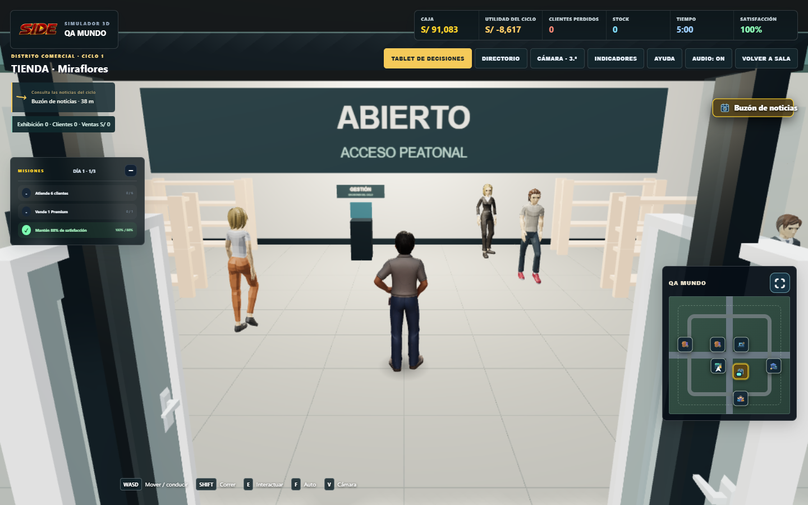
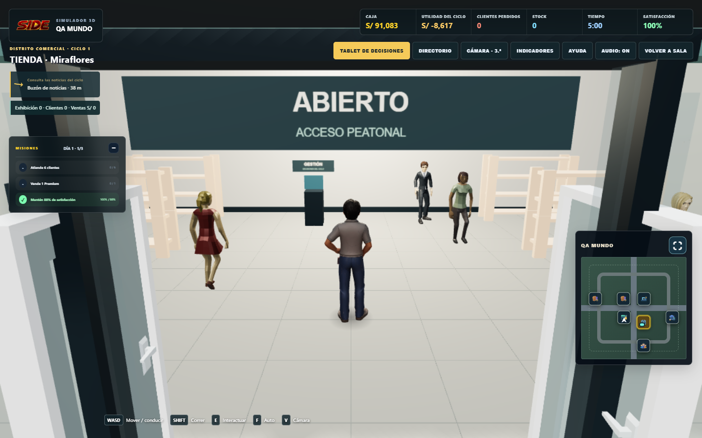
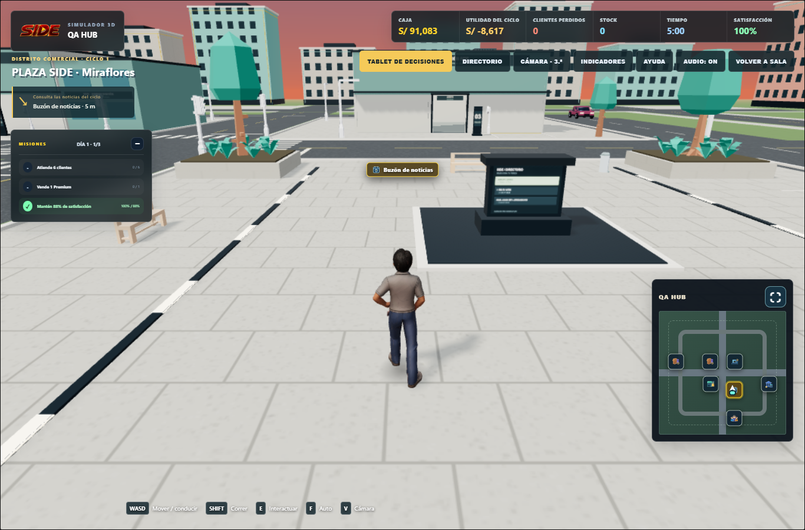
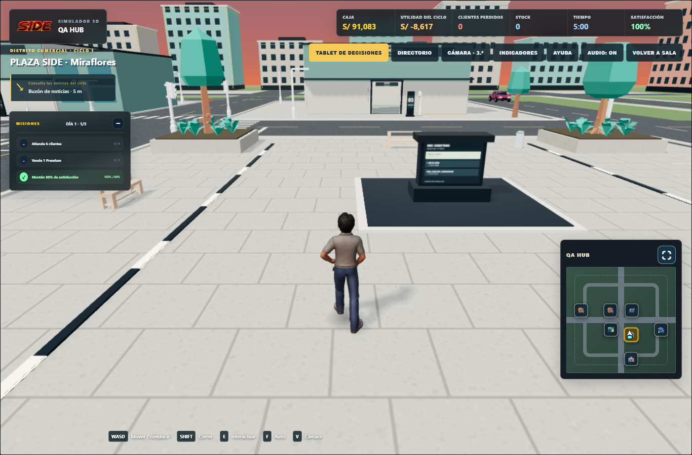

# Revisión independiente: NPC, tablet y HUD (30/09/2026)

## Hallazgos

Comparación completa desde `1746be4` hasta los commits de A/B/C/D/E y la integración del simulador, incluyendo modificaciones aún sin commit. Se excluyeron explícitamente activos, herramientas del pipeline y registros que ya estaban modificados antes de esta tarea.

**[P2] Priorizar el piso del interior sobre el terreno bajo la parcela — `js/simulator3d.js:1300` (resuelto).** El diagnóstico real de `world_startup.cjs` mostraba al jugador dentro de la tienda (x=131, z=20.955) con Y/suelo=-.005, mientras el piso construido termina en .025 m. Los personajes creados por la factoría general y el jugador recibían el terreno bajo el edificio; los NPC interiores específicos sí tenían override .025. Esto enterraba los pies unos 3 cm. Se informó al coordinador y se corrigió de forma localizada. La versión definitiva usa `businessInteriors.groundHeightAt(x,z)` con las matrices mundiales de las instancias reales de piso antes del terreno exterior, y elimina el override fijo para que también el courier se ancle correctamente al caminar fuera. Se añadieron aserciones contra esa superficie en las seis salas, para el jugador y una sonda de la factoría general de clientes. Verificación final PASS en navegador, raíz con tolerancia ≤1 cm y error observado 0; Node verifica además el piso transformado contra raycast del mesh real.

No se encontraron otros defectos accionables.

La revisión siguió `review-agent`, `game-playtest`, `systematic-debugging` y `verification-before-completion`; tras incorporarse al catálogo se leyeron también `webapp-testing` y `frontend-design` del directorio `.agents/skills/`. `with_server.py --help` se ejecutó correctamente. Se conservaron los runners Playwright/Node existentes por instrucción del usuario y sus servidores efímeros. El alcance de edición autorizado para esta fase se limitó al runner nuevo y este informe; no se modificó producción ni pruebas anteriores.

## Verificación independiente en navegador real

Nuevo runner: `tests/npc_world_fixes_browser.cjs`. Ejecuta Three.js/WebGL, GLB reales y las funciones de actualización de producción mediante instrumentación exclusiva de la respuesta del servidor de pruebas. Se bloquean terceros, se usa un origen efímero y almacenamiento aislado; no se conecta Supabase.

Comando: `node tests/run_world_regression.cjs npc_world_fixes_browser.cjs`.

Primera ejecución verificada de física real: **PASS**, salida 0, 30.706 s. Resultados completos: `tests/output/npc-tablet-hud-2026-09-30/npc-world-fixes-results.json`. La primera suite integrada también pasó los refinamientos: pies con tolerancia de 5 cm, comparación de altura NPC contra altura animada real del jugador cada segundo, desplazamiento neto por ventanas y actualización de cámara durante la conducción. La verificación final agrega la consulta del piso mundial definitivo, separada del Y que guarda el propio personaje.

| Cobertura | Evidencia inicial observada |
| --- | --- |
| Altura | Bounding boxes precisos de meshes, excluyendo etiquetas y sombras. Jugador 1.745–1.750 m; máximo NPC animado observado 1.74255 m. |
| Suelo exterior | Cuatro actores (tres peatones y guía), 60 s a 60 pasos/s. Error de Y raíz 0; variación del pie animado máxima 1.39 cm. |
| Suelo interior | Seis salas (tienda, almacén, producción, oficina, banco, proveedores), 60 s simulados cada una. Error de Y raíz 0; pie animado máximo 2.64 cm. |
| NPC estáticos | Doce ventanas consecutivas de 5 s; todos los actores exteriores recorren y se desplazan netamente más de 0.12 m en cada ventana. |
| Contacto a pie | Primera/tercera persona; distancia mínima 0.65 m, igual a suma de radios. Paso máximo 4.13 cm, sin penetrar sólidos; escape lateral 5.086 m. |
| Contacto en auto | El vehículo realmente avanza 1.9198 m antes de detenerse; distancia mínima desde el círculo del parachoques al NPC 1.23018 m, superior al contacto de 1.23 m. Ambas cámaras. |
| HUD | Ningún contenedor/etiqueta/flecha flotante en DOM, ningún grupo `Next destination` en escena; siete destinos del minimapa y paneles de métricas/misiones conservados. |

`node --check tests/npc_world_fixes_browser.cjs`: salida 0.

Verificación definitiva del runner sobre `73b27fc`: **PASS en 47.483 s**. Error raíz respecto al piso mundial: 0. Desfase máximo del pie animado: 2.186 cm. NPC por debajo del jugador en todas las muestras de animación, margen mínimo 3.19 mm. Desplazamiento neto mínimo por actor/ventana de 5 s: 2.632 m. Contacto a pie/auto, HUD y ausencia de errores JS mantienen los valores aprobados. Log: `verification-final/npc_world_fixes_browser.cjs.log`.

## Cobertura complementaria de los agentes

Las pruebas de A verifican unidades y pivotes de GLB, 16 modelos públicos reales y clips con root motion durante 60 s. B prueba rutas incompletas/nulas, spawn legal, watchdog y recuperación sin modificar posiciones. C prueba separación de solapamientos, contactos múltiples, esquinas, movimiento tangencial, peatones contra jugador y parachoques. D prueba 20 cierres desde cada uno de tres orígenes, foco, WASD/cámara, estado de decisiones y ciclo; también comprueba que cada cierre produce una sola devolución. E prueba ausencia de overlays y conservación de destinos tanto en minimapa como mapa expandido a 390/1366 px.

## Comparación visual

Capturas anteriores inspeccionadas directamente:

- `tests/output/npc-tablet-hud-2026-09-30/store-before.png`: tienda Miraflores, con rótulo flotante «Buzón de noticias» sobre el juego y NPC con distintas alturas aparentes/posición de pies.
- `tests/output/npc-tablet-hud-2026-09-30/plaza-before.png`: plaza, con rótulo flotante de noticias delante del entorno; minimapa y HUD visibles.

Capturas posteriores copiadas de los runners integrados y examinadas directamente:

- `tests/output/npc-tablet-hud-2026-09-30/store-after.png`, de `world_startup.cjs` final sobre `73b27fc` (escenarios all/sections completos PASS). Se mantiene el encuadre de tienda Miraflores; desaparece el rótulo flotante de noticias del lado derecho. Personajes con proporciones próximas al jugador y pies en el pavimento, permitiendo la postura de caminar. Diagnóstico del jugador en el mismo punto x=131/z=20.955: Y y suelo .025 m, corrigiendo los -.005 m anteriores. La selección aleatoria de NPC varía entre capturas; la comparación numérica de GLB cubre la altura sin confundir perspectiva/distancia.
- `tests/output/npc-tablet-hud-2026-09-30/plaza-after.png`, de `playable_hub.cjs` final sobre `73b27fc` (PASS). Mismo encuadre: desaparece el rótulo flotante frente al buzón, mientras siguen visibles el chip de noticias/distancia, métricas, misiones y destinos del minimapa.

## Límites de la evidencia

Las actualizaciones se simulan a 60 pasos/s para aislar la física de la GPU de software. La prueba de colisión usa una posición controlada del NPC y un trayecto recto del auto en la plaza; las pruebas de geometría cubren multitudes/esquinas. La sonda de clientes ejercita la factoría general y el anclaje; no añade un cliente a las reglas de ventas ni verifica operaciones de caja. No constituye una exploración exhaustiva de todas las combinaciones de calles y multitudes.

Los workers/cajeros estacionarios interiores conservan su estación de trabajo; el requisito de caminar permanentemente se verificó para peatones exteriores y guía. El rango del pie permite la elevación del paso de las animaciones, no desplazamiento acumulado de la raíz.

Chromium headless usa SwiftShader. Los JSON de la comparación controlada `fps-baseline.json` / `fps-final.json` fueron leídos directamente: medianas Baja 2→3 FPS, Media 2→2 FPS, Alta 1→1 FPS. El roster activo sigue en 6/10/16 modelos por tier. Las llamadas/triángulos cambian ligeramente en esta escena por los NPC ahora móviles y las posturas; la comparación estática de producción mantiene las mismas cifras y el exterior mejora. Estos FPS describen esta GPU de software y no certifican la tasa de una GPU física. Pointer lock puede exigir un gesto del navegador; el botón y Escape restauran foco/controles y la siguiente pulsación sobre el canvas puede obtener el bloqueo.

## Suite integrada

La verificación Node final sobre la integración definitiva `73b27fc` se ejecutó independientemente: **291/291 PASS**, 0 fallos, omitidas ni canceladas; salida 0, 34.774 s (`tests/output/npc-tablet-hud-2026-09-30/verification-final/node.log`). `node --check` en **28 archivos** de producción/pruebas modificados: 0 fallos (`verification-final/syntax.json`). La primera ejecución completa de 32 runners terminó en **31 PASS / 1 FAIL** (preservada en `verification-final/previous-32-runners.json`).

La ejecución final completa sobre las mismas fuentes, con un solo runner cada vez y GPU exclusiva, terminó en **31 PASS / 1 FAIL**, 885.840 s acumulados; salida global 1. Se preservaron `verification-final/regression.json`, `browser.log` y los 32 logs individuales. Los 16 runners originales pasan, al igual que todas las regresiones nuevas de Tablet, NPC y HUD, las navegaciones/interiores y la comprobación del presupuesto exterior. El único fallo es el presupuesto de producción heredado descrito abajo.

`production_performance.cjs`: tienda/Baja, 220 draw calls frente al límite existente de 195 en la primera ejecución y repetición aislada; **221 > 195 en la ejecución final** (11.813 s). La repetición aislada con GPU exclusiva descarta competición con otros procesos como explicación de ese resultado. La comparación controlada del agente HUD con fuentes originales `1746be4` en memoria y una semilla fija muestra las mismas llamadas en base y final: tienda 221/237/237 y producción 173/193/193 (Baja/Media/Alta); exterior final mejora dos llamadas y 488 triángulos. El incumplimiento de llamadas ya existe en la base y los triángulos cumplen. No se cambian los límites ni se hace push con ese fallo.

## Evaluación de los seis puntos solicitados

1. **Talla:** normalización común por bounding box; prueba de GLB reales y comparación de meshes animados NPC ≤ jugador aprobadas.
2. **Peatones inmóviles:** los tres peatones de plaza y la guía tienen progreso neto en cada ventana durante 60 s; los watchdogs/rutas fallidas se verifican adicionalmente en Node.
3. **Flotación:** raíz sobre superficie mundial con error observado 0; pivotes corregidos y pies animados dentro de 2.186 cm. Se detectó/corrigió también el terreno bajo interiores y se prueba transformación real del piso.
4. **Tablet:** 60 cierres desde tres orígenes físicos (20 cada uno), Escape/botón, foco de input, controles, cámara, callback único y estado financiero/ciclo conservados; runner final PASS.
5. **HUD:** cero destinos flotantes en DOM/escena, siete iconos de mapa conservados, chip de distancia y métricas/misiones intactos. Capturas antes/después revisadas; tres viewports móviles también PASS.
6. **Colisiones:** contacto/tangente/escape a pie y frenado del auto aprobados en ambas cámaras; Node cubre solapamientos/multitudes/esquinas. Ningún actor teletransportado ni empuje fuera de límites observado en esos escenarios.

No quedan defectos introducidos y sin resolver identificados por esta revisión. Pendiente externo a las correcciones solicitadas: optimizar el presupuesto de llamadas heredado. Los commits se mantienen locales y el push no procede mientras ese runner siga fallando, conforme a la instrucción del usuario.
